# DevOps CI/CD Pipeline with Jenkins, SonarQube, and Docker

This project demonstrates a complete DevOps CI/CD pipeline using:

- **GitHub** → Code repository
- **Jenkins** → CI/CD automation
- **SonarQube** → Code quality analysis
- **Docker** → Containerization and deployment
- **Flask** → Simple Python web application

📌 **Project Structure**

```
project10/
├── app.py                # Flask application
├── requirements.txt      # Python dependencies
├── Dockerfile            # Docker image instructions
├── Jenkinsfile           # Jenkins pipeline configuration
├── README.md             # Project documentation
```

## 1. Prerequisites (what you need)

- A machine (VM or cloud) running **Ubuntu or Linux 20.04+** (or similar).
- For **SonarQube**: ≥ 4 GB RAM recommended (2 GB minimum, but community features and Elasticsearch perform better with 4GB).
- For **Jenkins**: 2+ GB recommended.
- Installed tools on that machine (we’ll install them below): `git`, `docker`, `docker-compose`, `java` (for Jenkins), `pip` (optional).
- A **GitHub account** and repository (you already have `project10`).
- A **SonarQube token** (we’ll create SonarQube server locally and generate token).
- Basic familiarity with terminal commands (I’ll include exact commands).

## 2. Set up Docker (so we can run Jenkins & Sonar easily)

```bash
sudo yum install docker -y
sudo systemctl start docker
sudo docker pull sonarqube
```

- Run SonarQube:
  ```bash
  sudo docker run -d --name sonarqube -p 9000:9000 sonarqube
  ```
- Access SonarQube at: `http://<your-server-ip>:9000`
- Default credentials: `admin` / `admin` (log in and change password).

## 3. Create a Sonar token

- In SonarQube UI: Top-right → **My Account** → **Security** → **Generate Token** → Name it (e.g., `jenkins-token`). Copy the token.

## 4. Install Jenkins (on same server)

```bash
sudo yum update –y
sudo wget -O /etc/yum.repos.d/jenkins.repo \
    https://pkg.jenkins.io/redhat-stable/jenkins.repo
sudo rpm --import https://pkg.jenkins.io/redhat-stable/jenkins.io-2023.key
sudo yum upgrade
sudo dnf install java-17-amazon-corretto -y
sudo yum install jenkins -y
sudo systemctl enable jenkins
sudo systemctl start jenkins
```

- Access Jenkins: `http://<your-server-ip>:8080`
- Follow initial unlock instructions (use the password from `/var/lib/jenkins/secrets/initialAdminPassword`).
- Install recommended plugins when prompted (or install required ones later).

## 5. Install Jenkins plugins and tools

- In Jenkins UI → **Manage Jenkins** → **Manage Plugins**:
- Install:
  - **Git plugin**
  - **Pipeline**
  - **Docker Pipeline**
  - **SonarQube Scanner for Jenkins**

## 6. Configure SonarQube in Jenkins

- **Manage Jenkins** → **Configure System** → **SonarQube servers**
- Add SonarQube:
  - **Name**: SonarQube
  - **Server URL**: `http://<your-server-ip>:9000`
  - **Server authentication token**: Enter token from Sonar UI (the `jenkins-token`) — click **Add** → **Jenkins** credential as **secret text**, give ID (optional).
- Save.
- **Manage Jenkins** → **Global Tool Configuration** → **SonarQube Scanner**
- Add SonarQube Scanner installation:
  - **Name**: SonarScannerCLI
  - Optionally tick **Install automatically** (Jenkins will download scanner).

## 7. Add Sonar token as Jenkins Credential (best practice)

- **Manage Jenkins** → **Credentials** → **System** → **Global credentials** → **Add Credentials**:
  - **Kind**: Secret text
  - **Secret**: `<your-sonar-token>`
  - **ID**: SONARQUBE_TOKEN (choose this ID)
  - **Description**: SonarQube token
- We’ll reference this in the pipeline.

## 8. Make sure Jenkins user can run Docker

- If Jenkins runs on the same host and will build/run Docker images, add `jenkins` user to `docker` group:
  ```bash
  sudo usermod -aG docker jenkins
  ```

## 9. Create Jenkins Pipeline Job

- Jenkins → **New Item** → Name `project10-pipeline` → **Pipeline** → **OK**.
- Pipeline → **Definition**: Pipeline script or **Pipeline script from SCM**.
- If from SCM, choose **Git**, repo URL (`https://github.com/your-username/project10.git`), Branch `main`, script path `Jenkinsfile`.
- Save and **Build Now**.

## Architecture Diagram

Below is the architecture diagram in Mermaid syntax, visualizing the CI/CD pipeline flow. Copy this into a Mermaid-compatible renderer (e.g., GitHub or Mermaid Live) to view with icons for GitHub, Jenkins, SonarQube, Docker, and the Flask app.

```mermaid
flowchart LR
    A[Developer] -->|Pushes Code| B(GitHub Repository)
    B -->|Webhook/Polling Trigger| C[Jenkins]
    subgraph Server [Linux Server - Ubuntu/Linux 20.04+]
        C -->|Clone Repo| D[SonarQube Analysis]
        D -->|Quality Gate| E[Build Docker Image]
        E -->|Run Container| F[Flask App Container]
    end
    C[Jenkins] --> D[SonarQube]
    D --> E[Docker]
    E --> F[Docker Container]

    style A fill:#f9f,stroke:#333,stroke-width:2px
    style B fill:#6cc644,stroke:#333,stroke-width:2px  // GitHub green
    style C fill:#0099ff,stroke:#333,stroke-width:2px  // Jenkins blue
    style D fill:#4c9aff,stroke:#333,stroke-width:2px  // SonarQube blue
    style E fill:#0db7ed,stroke:#333,stroke-width:2px  // Docker blue
    style F fill:#0db7ed,stroke:#333,stroke-width:2px
    style Server fill:#ff9900,stroke:#333,stroke-width:2px  // Server orange
```



## Additional Configuration Details

### Sample `Jenkinsfile`
```groovy
pipeline {
    agent any
    tools {
        jdk 'JDK17' // Ensure JDK 17 is configured in Global Tool Configuration
    }
    environment {
        SONAR_TOKEN = credentials('SONARQUBE_TOKEN') // References Jenkins credential
    }
    stages {
        stage('Clone Repository') {
            steps {
                git url: 'https://github.com/your-username/project10.git', branch: 'main'
            }
        }
        stage('SonarQube Analysis') {
            steps {
                withSonarQubeEnv('SonarQube') {
                    sh '''
                    sonar-scanner \
                      -Dsonar.projectKey=project10 \
                      -Dsonar.sources=. \
                      -Dsonar.host.url=http://<your-server-ip>:9000 \
                      -Dsonar.login=$SONAR_TOKEN
                    '''
                }
            }
        }
        stage('Build Docker Image') {
            steps {
                sh 'docker build -t project10-flask .'
            }
        }
        stage('Run Docker Container') {
            steps {
                sh 'docker run -d -p 5000:5000 project10-flask'
            }
        }
    }
}
```

### Sample `Dockerfile`
```dockerfile
FROM python:3.9-slim
WORKDIR /app
COPY requirements.txt .
RUN pip install --no-cache-dir -r requirements.txt
COPY app.py .
EXPOSE 5000
CMD ["python", "app.py"]
```

### Sample `app.py`
```python
from flask import Flask
app = Flask(__name__)

@app.route('/')
def hello():
    return 'Hello from Flask!'

if __name__ == '__main__':
    app.run(host='0.0.0.0', port=5000)
```

### Sample `requirements.txt`
```
Flask==2.0.1
```

## Troubleshooting
- **Jenkins Fails**: Check `/var/log/jenkins/jenkins.log` or `systemctl status jenkins`.
- **SonarQube Fails**: Ensure port 9000 is open, check Docker logs: `docker logs sonarqube`.
- **Docker Issues**: Verify `jenkins` user is in `docker` group; restart Docker if needed.
- **Network**: Ensure firewall allows ports 8080 (Jenkins), 9000 (SonarQube), 5000 (Flask).
- **Sonar Scanner Errors**: Verify token and URL in Jenkinsfile.

## Cleanup
- Stop Docker containers: `docker stop sonarqube && docker rm sonarqube`.
- Remove Docker images: `docker rmi sonarqube project10-flask`.
- Stop Jenkins: `sudo systemctl stop jenkins`.
- Delete GitHub webhook if configured.
- Terminate server if on cloud (e.g., AWS EC2).

---
